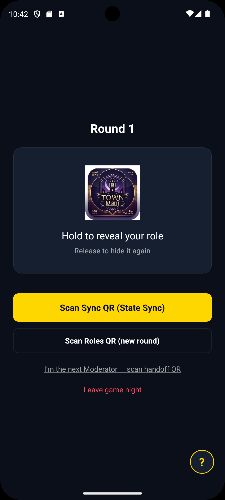
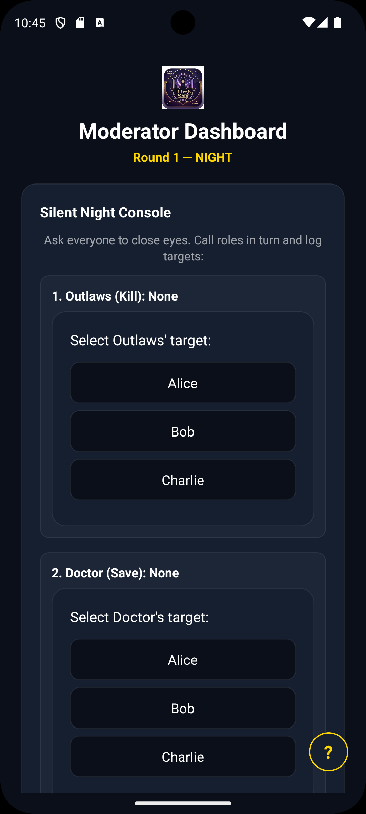
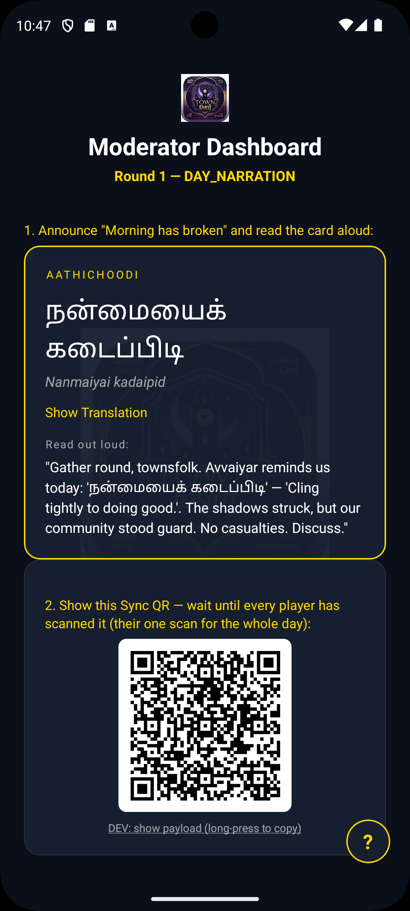

# Townsquare

Townsquare is a serverless, self-contained social deduction party game (Mafia/Werewolf style) for iOS and Android, built with **React Native (Expo)** and **TypeScript**. 

It is designed as a digital replacement for role-card decks, allowing 6 to 16 players to play together in the same room.

---

## 📸 Screenshots

<!-- Capture three portrait screenshots on a phone (dark theme, mid-game with real player
     names) and save them here. GitHub will render the row once the files exist. -->

| Get your role | Silent Night console | Tamil narration |
|:---:|:---:|:---:|
|  |  |  |

---

## 🚀 Key Features (Protocol v3.2)

* **100% Offline Gameplay (Zero-Network):** The entire game runs completely offline using co-located device-to-device QR code exchanges and silent physical gestures. The app makes no network calls, sends no SMS, and collects no phone numbers — a player's first name is the only personal data it ever holds (v3.1).
* **Name-Keyed Role Obfuscation:** The Moderator broadcasts a single `roles` QR code. Each player's device reveals only their own role, XOR-obfuscated with a keystream from their public name — enough to keep a stock camera from reading roles off the QR (keyed obfuscation, not encryption, by design):
  $$\text{keystream} = \text{SHA-256}(\text{playerName} \mathbin{\Vert} \text{sessionId} \mathbin{\Vert} \text{roundNumber})$$
  $$\text{ciphertext} = \text{plaintext} \oplus \text{keystream}$$
  A stock camera app scanning the QR code sees only base64 noise.
* **Silent Night Console:** The Moderator runs the classic eyes-closed pointing ritual in the room and logs targets directly in-app, eliminating the "whose phone buzzed" role leak and the need for night SMS.
* **Secret Ballot Day Votes:** Players secretly select their vote targets in-app, generating a personal `ballot` QR. The Moderator scans each screen to compile a live vote tally, keeping choices secret until finalized.
* **Tamil Narration Engine:** Features a cultural narration deck of 50 classical Tamil moral sayings from Avvaiyar (**Aathichoodi** and **Konrai Vendhan**) and Subramania Bharati (**Puthia Aathichoodi**) mapped to the 6 phases of the game.
* **"Hold to Reveal" Role Card:** Prevents shoulder-surfing by showing roles only when a player presses and holds the screen.
* **Secure Storage Split:** Uses Keychain-level `expo-secure-store` to encrypt the local profile (name), and standard `AsyncStorage` to cache the non-sensitive roster and win-tally.

---

## 🛠️ Local Environment Setup

### Prerequisites
* [Node.js LTS](https://nodejs.org/)
* Android Studio (for SDK platform-tools / AVDs)
* Expo CLI and EAS CLI (`npm install -g eas-cli`)

### 1. Install Dependencies
Due to peer dependency version mismatches in the Expo / React Native toolchain, always run installs using the legacy flag:
```bash
npm install --legacy-peer-deps
```

### 2. Run the Development Server
To launch Metro and load the app on your emulator or physical devices:
* **For standard Expo Go testing:**
  ```bash
  npx expo start
  ```
* **For an EAS development build (real-device camera testing):**
  ```bash
  npx expo start --dev-client
  ```

### 3. Run Unit Tests & Type Checks
* **Run Jest Tests:**
  ```bash
  npm test
  ```
* **Run Compiler Check:**
  ```bash
  npx tsc --noEmit
  ```

---

## 📱 Staged Testing & Validation Roadmap

### Tier A: Developer AVD Rig (Zero accounts, zero cameras)
You can run a complete 4-player game loop (Moderator + 3 players) on your local Windows PC using Android Virtual Devices (AVDs):
1. **Dev Minimum Override:** In `__DEV__` builds, the minimum player count is lowered to 3 players (4 total including Moderator).
2. **Dev Clipboard Sharing:** In `__DEV__` builds, every QR displays a long-press-copyable text string, and the scanner view contains a text paste box. Since emulators share the clipboard with Windows, copy the payload from AVD A's screen and paste it into AVD B's scanner to "scan" it.

### Tier B: Real-Device Testing (Expo Go)
Verify optical camera scanning and haptics by running the Metro server and scanning the terminal QR from both of your physical iPhones using the Expo Go app.

### Tier C: EAS Cloud Builds
Once your D-U-N-S business registration clears:
1. Register UDIDs: `eas device:register`
2. Build iOS Client: `eas build --profile development --platform ios`
3. Scan the install QR on your iPhones to verify camera-based QR scanning and haptics on a real build.

---

## 📂 Project Structure

```
├── assets/                    # Image assets (brand icon, splash screens)
├── src/
│   ├── components/            # Reusable UI (RoleRevealCard, TargetPicker)
│   ├── engine/                # FSM state machine & Night resolution logic
│   ├── screens/               # App screens (Setup, Player, Moderator)
│   ├── services/              # Core services (QRCodec, NarrationEngine, rolesScan)
│   ├── state/                 # App reducer, contexts, and PersistenceStore
│   ├── theme/                 # Obsidian colors and design tokens
│   └── types/                 # TypeScript interfaces and payloads
└── __tests__/                 # Jest test suites
```

---

## 🔒 Privacy

Townsquare collects **nothing** — no accounts, no analytics, no network calls. The only
input is a self-chosen play-name (a nickname, never a real identity) stored locally on the
device and used only to label a role during a game. See [PRIVACY.md](PRIVACY.md) for the
full policy.
