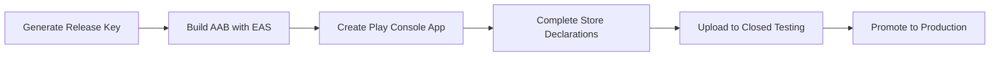

# System Design Specification: Townsquare Game App
**Author**: Senior Principal Game Application Software Engineer
**Project**: Townsquare (Mafia-style Mobile Game for iOS & Android)
**Architecture Style**: Serverless, Zero-Network, Multi-Device, QR-First In-Room Orchestration — Protocol v3.2

---

## 1. Executive Summary & Design Philosophy
**Townsquare** is a mobile implementation of the classic social deduction game *Mafia/Werewolf*, built to replace the physical role-card deck for a group playing together **in the same room** — friends, or students in a Tamil-language class.

### Core Constraints
- **In-person only.** All players are physically together. Group discussion, nominations, and voting happen out loud in the room; the app never needs to carry group conversation. Remote/conferencing play is explicitly **out of scope**.
- **Every player runs the app on their own phone.** There is no single shared "moderator device" — any player's phone can become the Moderator device for a round.
- **No backend server, no accounts, no SMS, no network at all** (v3.1). Every exchange rides on QR codes or classic silent gestures — a full game night is playable with zero cellular signal, and the app requests no network-adjacent permissions of any kind (no `SEND_SMS`/`READ_SMS`, no URL scheme). SMS and deep links existed in v2/v3 and were fully retired in v3.1 (§6.4).
- **Names are the only personal data.** With SMS gone, phone numbers left the system entirely: a player's first name is everything the app ever holds about them.
- **QR-first for everything synchronous and in-room** (everyone is standing together, so a screen-shown QR is the cheapest channel that exists — free, offline, no data entry): session join and join-acknowledgement, role assignment (per-player name-keyed obfuscation — see §6.3), day-state sync, vote ballots, and moderator handoff.
- **Night actions use no technology at all**: eyes closed, silent pointing, exactly as the classic game — the Moderator taps what they saw into their own device. This removes both the "whose phone buzzed" role leak and the largest SMS payloads of the earlier protocol.
- **Single active game night at a time.** The app remembers only the current sitting's participants, purely to make replaying additional rounds fast. There is no cross-session history, statistics, or archive — starting a new game night discards the previous roster entirely.
- **Roles and the Moderator duty rotate fairly** across rounds within one sitting, including back onto players who have already moderated, so everyone gets a turn at every role over the course of an evening.

---

## 2. Terminology
The words "game" and "round" are overloaded in casual speech, so this spec fixes them precisely:

| Term | Definition | Old-spec equivalent |
|---|---|---|
| **Session** | One sitting — the group of friends playing together tonight. Holds the roster and the rotation-fairness tally. Ends when someone taps "New Game Night." | *(new concept)* |
| **Round** | One complete playthrough of Mafia, from role assignment to a Town/Outlaw win. Roles and the Moderator are reassigned at the start of each Round. | `game_sessions` |
| **Phase** | A single Night/Day step within a Round (e.g. `NIGHT`, `DAY_VOTE`). | `game_rounds` |

---

## 3. Player Limits & Role Distribution Table
The game supports **6 to 16 players**, one of whom also serves as Moderator for the Round (the Moderator does not occupy a Town/Outlaw role slot). Roles are assigned at the start of each Round using the balance table below, subject to the fairness rotation described in [Section 8](#8-role--moderator-rotation-fairness).

| Total Players ($N$) | Outlaws ($O$) | Detective | Doctor | Vanilla Town | Total Town ($T$) | Outlaw-to-Town Ratio |
|:---:|:---:|:---:|:---:|:---:|:---:|:---:|
| **6** | 1 | 1 | 1 | 3 | 5 | 1 : 5.00 |
| **7** | 2 | 1 | 1 | 3 | 5 | 1 : 2.50 |
| **8** | 2 | 1 | 1 | 4 | 6 | 1 : 3.00 |
| **9** | 2 | 1 | 1 | 5 | 7 | 1 : 3.50 |
| **10** | 2 | 1 | 1 | 6 | 8 | 1 : 4.00 |
| **11** | 3 | 1 | 1 | 6 | 8 | 1 : 2.67 |
| **12** | 3 | 1 | 1 | 7 | 9 | 1 : 3.00 |
| **13** | 3 | 1 | 1 | 8 | 10 | 1 : 3.33 |
| **14** | 4 | 1 | 1 | 8 | 10 | 1 : 2.50 |
| **15** | 4 | 1 | 1 | 9 | 11 | 1 : 2.75 |
| **16** | 4 | 1 | 1 | 10 | 12 | 1 : 3.00 |

> **Note**: the jump from 6→7 players (1→2 Outlaws) is a noticeably bigger swing in threat ratio than any other step in this table. Worth a playtest check before finalizing.

---

## 4. System & App Architecture

The app is built using **React Native with Expo**, one codebase for iOS and Android. Every install can act as either a **Player** device or the current round's **Moderator** device — it's a runtime mode, not a build variant.

### Project Directory Structure
```text
townsquare/
├── App.tsx                        # Alert surface, scanner overlay, screen routing
├── app.json                       # Expo config: camera permission strings
├── eas.json                       # EAS Build profiles (development / preview / production)
├── src/
│   ├── components/
│   │   ├── AathichoodiCard.tsx    # Gold-framed Tamil saying, translation toggle, narrator script
│   │   ├── PlayerRow.tsx          # Roster row (name, role chip, status)
│   │   ├── RoleRevealCard.tsx     # Hold-to-Reveal private role card
│   │   ├── QRScannerView.tsx      # Camera scanner for join + handoff QRs
│   │   └── TargetPicker.tsx       # One-tap night-action target chooser
│   ├── screens/
│   │   ├── SetupScreen.tsx        # First run: player enters own name (only personal data)
│   │   ├── PlayerScreen.tsx       # Join/create, waiting state, role card, night prompts
│   │   └── ModeratorScreen.tsx    # Phase-driven console: lobby QR, role links, Quick-Log, handoff
│   ├── state/
│   │   ├── dispatch.ts            # Pure appReducer: incoming links, lifecycle actions, alerts
│   │   ├── SessionContext.tsx     # React context wiring reducer to PersistenceStore
│   │   ├── PersistenceStore.ts    # SecureStore/AsyncStorage-backed session state
│   │   └── RotationFairness.ts    # Weighted role/moderator assignment
│   ├── engine/
│   │   ├── GameStateMachine.ts    # FSM Phase controller with guarded transitions
│   │   ├── NightResolution.ts     # Pure kill/save/investigate outcome resolver
│   │   └── RoleTable.ts           # §3 balance table keyed by role-holder count
│   ├── services/
│   │   ├── QRCodec.ts             # Six QR wire formats + name-keyed role obfuscation
│   │   └── NarrationEngine.ts     # 50-saying Tamil narration database & picker (§9)
│   ├── theme.ts                   # §10.2 design tokens
│   └── types/
│       └── index.ts               # Shared type definitions
```

> **Role-holder count vs. room size**: the §3 balance table is keyed by **role-holders** — players *excluding* the Moderator, who occupies no role slot. A room of 7 people (1 Moderator + 6 holders) uses table row N=6; the minimum viable room is therefore **7 people**. `src/engine/RoleTable.ts` implements it this way.

---

## 5. Local State Persistence

There is no SQLite database and no relational schema — with a single active Round and no cross-session history, a single persisted JSON blob per device is sufficient, and it must survive an accidental app close mid-session (confirmed requirement).

### Storage split
| Data | Where | Why |
|---|---|---|
| `self` profile (this device's own name/role) | `expo-secure-store` (iOS Keychain / Android Keystore) | Small (a few dozen bytes), always present on every device, worth the real hardware-backed encryption at rest. |
| `roster` + `rotationTally` (Moderator device only) | `AsyncStorage` (plain) | Can approach `expo-secure-store`'s ~2KB practical value-size limit at 16 players. This data is already known to whoever is Moderator (they entered it), is session-scoped, and is wiped on "New Game Night" — so plain local storage is an acceptable, documented tradeoff rather than an oversight. |

### Schema (`src/types/index.ts`)
```typescript
export type TownsquareRole = 'OUTLAW' | 'DETECTIVE' | 'DOCTOR' | 'TOWN' | 'UNASSIGNED';
export type PlayerStatus = 'WAITING_FOR_MODERATOR' | 'ACTIVE' | 'DECEASED' | 'ELIMINATED';

export interface PlayerProfile {
  name: string;
  role: TownsquareRole;
  status: PlayerStatus;
  isModerator: boolean;
}

export interface RoundAction {
  actor: string;
  action: 'KILL' | 'SAVE' | 'INVESTIGATE' | 'NOMINATE' | 'VOTE';
  target: string;
}

export interface RotationCounts {
  moderator: number;
  outlaw: number;
  detective: number;
  doctor: number;
  town: number;
}

export type RotationTally = Record<string, RotationCounts>; // keyed by player name

export interface NightOutcome {
  victim?: string;                  // undefined when the Doctor's save landed or no kill was logged
  saved: boolean;
  investigation?: { target: string; isOutlaw: boolean };
}

export interface SessionState {
  sessionId: string;                 // '' until a session is created/joined; regenerated on "New Game Night"
  deviceMode: 'PLAYER' | 'MODERATOR';
  roundNumber: number;
  phase: RoundPhase;
  self: PlayerProfile;
  moderatorPhone?: string;           // player devices: learned from the join QR, target for reply links
  companions?: string[];             // player devices: fellow Outlaws, from the role link
  pendingPrompt?: { w: NightVerb; l: string[] }; // player devices: an unanswered night prompt
  roster?: PlayerProfile[];          // present only when deviceMode === 'MODERATOR'
  pendingActions?: RoundAction[];    // present only when deviceMode === 'MODERATOR'
  lastOutcome?: NightOutcome;        // moderator device: most recent night resolution, drives narration
  rotationTally: RotationTally;
}
```

### `PersistenceStore.ts`
```typescript
import * as SecureStore from 'expo-secure-store';
import AsyncStorage from '@react-native-async-storage/async-storage';
import type { SessionState } from '../types';

const SELF_KEY = 'townsquare_self_v1';
const ROSTER_KEY = 'townsquare_roster_v1';

export class PersistenceStore {
  static async save(state: SessionState): Promise<void> {
    const { roster, pendingActions, ...selfScoped } = state;
    await SecureStore.setItemAsync(SELF_KEY, JSON.stringify(selfScoped));
    if (state.deviceMode === 'MODERATOR') {
      await AsyncStorage.setItem(ROSTER_KEY, JSON.stringify({ roster, pendingActions }));
    }
  }

  static async load(): Promise<SessionState | null> {
    const rawSelf = await SecureStore.getItemAsync(SELF_KEY);
    if (!rawSelf) return null;
    const selfScoped = JSON.parse(rawSelf);
    if (selfScoped.deviceMode !== 'MODERATOR') return selfScoped;

    const rawRoster = await AsyncStorage.getItem(ROSTER_KEY);
    const rosterScoped = rawRoster ? JSON.parse(rawRoster) : { roster: [], pendingActions: [] };
    return { ...selfScoped, ...rosterScoped };
  }

  /** Called on "New Game Night" — the only way session data is ever discarded. */
  static async clear(): Promise<void> {
    await SecureStore.deleteItemAsync(SELF_KEY);
    await AsyncStorage.removeItem(ROSTER_KEY);
  }
}
```

---

## 6. Transport Protocol (v3)

> **Implementation status (2026-07-03)**: the committed code implements the earlier **v2 (Model B)** protocol — SMS deep links for join-ack, night prompts/actions, and investigation results. This section specifies the approved **v3** target; migrating the code is **Phase 3** (see handoff-ledger). Rows marked *(v2, retired)* in §6.4 remain in the code until then.

Every exchange uses the cheapest channel that satisfies its privacy need. In-room synchronous traffic rides on QR; silent gestures cover the night. (v3.1: the two SMS edge rows below were retired entirely — see §6.4.)

| # | Exchange | Direction | Transport | Privacy | Why this transport |
|---|---|---|---|---|---|
| 1 | Session join — invitation | Moderator's screen → all Players | **QR** (`join`) | Public | One broadcast seeds every scanner with session id + moderator identity. Zero data entry. |
| 2 | Session join — acceptance | Player's screen → Moderator | **QR** (`joinAck`) | Public | Carries just the self-entered name. Moderator scans each joiner once; roster builds itself. |
| 3 | Night actions (kill / save / investigate + result) | In the room | **Silent gestures** — no technology | Eyes-closed | The classic mechanic. Moderator taps what they saw into the Quick-Log pickers on their own device. Eliminates the "whose phone buzzed" role leak and the largest SMS payloads of v2. |
| 4 | Role assignment | Moderator's screen → all Players | **QR** (`roles`), per-player **name-keyed** | Obfuscation | One broadcast assigns every role. Each entry XOR-obfuscated with a keystream from that player's public name (§6.3) — a stock camera app sees base64 noise; each device shows only its own role. Outlaw companion lists ride inside the entry. |
| 5 | State sync (deaths, eliminations, phase, round) | Moderator's screen → all Players | **QR** (`sync`) | Public | Shown **once each morning** — the single scan of the day cycle. It delivers the new statuses (the only new digital fact of the day) and unlocks that day's ballot; "the vote is called" is verbal-native and needs no transport. Stays on later day screens as latecomer catch-up. |
| 6 | Day vote ballot | Player's screen → Moderator | **QR** (`ballot`) | Secret until scanned | Player picks a target in-app; Moderator scans each alive player's ballot QR (~3s each). Free, offline, no segment limits. Verbal nomination stays out loud; only the ballot is digital. |
| 7 | Moderator handoff | Outgoing → incoming Moderator | **QR** (`handoff`) | Public | Roster + rotation tally, compact wire format, 2KB-guarded. |
| ~~8~~ | ~~First-install invite (SMS)~~ | — | **Retired in v3.1** | — | Store link shared out-of-band (any messaging app); the app never composes messages. |
| ~~9~~ | ~~Role recovery (SMS deep link)~~ | — | **Retired in v3.1** | — | The Moderator's console knows all roles — they quietly tell/show the player, as a physical game would. |

> **Why the join handshake exists at all**: every later payload's `sid` check needs the player's device to already know the session id — the join QR is what seeds it. The `joinAck` returns the player's name so the Moderator's roster (and later the name-keyed roles QR) can address them.

### 6.4 SMS & deep links: fully retired (v3.1, 2026-07-05)

Protocol v3.1 removes SMS and the `townsquare://` deep-link scheme **entirely** — code, dependencies (`expo-sms`, `expo-linking`), the URL scheme registration, and the phone-number field they existed to serve. The full v2/v3 deep-link design (wire keys, character budgets, `DeepLinkManager`, cold/warm-start URL handling) is preserved in git history at commit `d3afdca` and earlier.

What replaced the two surviving SMS jobs:
- **Role recovery** (a player whose camera can't scan): the Moderator's console shows every role — they quietly tell or show that player their role, exactly as a physical game night would handle it. No transport needed.
- **First-install invite**: a store link shared by any channel the group already uses (WhatsApp, plain SMS typed by a human, word of mouth). The app itself never composes messages.

The payoff: **the app now collects no phone numbers at all** — a player's first name is the only personal data anywhere in the system (see §11), and the entire game is exchanged over six QR kinds (§6.2) plus silent gestures (§6 row 3).

### 6.2 QR wire formats (`QRCodec.ts`)
Six QR kinds (v3), discriminated by a `k` field so scanning the wrong one fails cleanly. **Wire format is compact, not verbose JSON of the rich types** — a 16-player handoff serialized naively is ~3KB, past the 2KB budget (and past QR byte-mode capacity at low error correction; a unit test guards this).

```
join:    { k:'j', s, r, m }                         # sid, round, moderator name
joinAck: { k:'a', s, n }                            # player's name
roles:   { k:'r', s, r, e:{ name: <ciphertextB64> } }  # per-player name-keyed role entry (§6.3)
sync:    { k:'s', s, r, ph, st:[[name, statusCode],...] }  # phase + A/D/E/W status codes
ballot:  { k:'b', s, r, x, t }                      # voter, target
handoff: { k:'h', s, r, ro:[name,...], t:{ name:[moderator,outlaw,detective,doctor,town] } }
```

Notes:
- The `roles` ciphertext for each player decrypts to `role code [+ '|' + companion names]` — Outlaw companions never appear in cleartext on the wire.
- The `sync` status codes map to `PlayerStatus`: `A`=ACTIVE, `D`=DECEASED, `E`=ELIMINATED, `W`=WAITING_FOR_MODERATOR, `M`=the Moderator (ACTIVE, but excluded from every ballot/target picker — the Moderator holds no role and can never be voted out).
- On handoff the receiving reducer wipes `role`/`status`/`isModerator` anyway, so the wire carries only what survives the scan.
- Rendered via `react-native-qrcode-svg` on the sender's screen; scanned with `expo-camera` (`QRScannerView.tsx`). The ballot flow inverts the usual direction: the **Moderator** scans each player's screen.
- All six kinds stay under the 2KB guard at 16 players (unit-tested for the largest, `handoff` and `roles`).

### 6.3 Role obfuscation (name-keyed, v3.2)
Each player's role entry in the `roles` QR is XOR-obfuscated with a keystream derived from the player's **public name** — no secret token exists:

```
keystream  = SHA-256(playerName ‖ sid ‖ roundNumber ‖ block)   # block 0 omits the suffix
ciphertext = plaintext XOR keystream[0..len]                   # base64-encoded on the wire
```

The Moderator encrypts each entry keyed on that player's name (it holds the roster); a player decrypts their own entry keyed on their own name. Nothing secret is generated, exchanged, stored, or carried on any wire.

**What this is (honestly): keyed obfuscation, not encryption.** Its sole goal is *casual/accidental non-disclosure* — a player scanning the roles QR with a stock camera app to be helpful sees base64 noise (`{"Alice":"QQ=="}`), not `{"Alice":"OUTLAW"}`. The key is derivable by anyone who knows a player's name (spoken aloud, in the sync QR) and reads the sid off the QR, so a *determined* player can decrypt everyone. That is accepted — it is exactly the trust model §11 applies everywhere else (a determined cheater ≈ someone peeking at a physical card). Per-entry, round-fresh (roundNumber is in the derivation), and per-name-fresh, so identical roles never share a keystream across players or rounds.

**History**: v3 used a per-player secret 16-byte token (generated at join, exchanged via `joinAck`, carried on the handoff wire) that gave *cryptographic* per-player secrecy — stronger than the app's own trust model, and its single most complex, most bug-prone subsystem (the item-18 handoff-token bug; plaintext-token storage). v3.2 (pet-approved 2026-07-06) replaced it with the name-keyed scheme above: same casual-glance protection, the entire token plumbing deleted, and roles brought down to the same bar as the rest of the app.

**Keystream length**: one SHA-256 gives 32 keystream bytes. A role plaintext longer than that (a long Outlaw companion list in a big game) derives further blocks CTR-style — `SHA-256(playerName ‖ sid ‖ roundNumber ‖ block)` for block > 0 — rather than reusing the first block; block 0 stays the bare input, so short entries are byte-identical to the original single-block scheme. (Ledger item 37.)

### End-of-round rotation flow
1. Current Moderator's app picks the next Moderator using [Section 8](#8-role--moderator-rotation-fairness)'s fairness algorithm (or lets the human Moderator override the suggestion).
2. Current Moderator shows the handoff QR code; the chosen successor scans it. Their device flips `deviceMode` to `MODERATOR` and persists the roster + tally. The payload's `roundNumber` is the outgoing round **+ 1** — this is the only place the round counter advances, and §6.3's keystream freshness depends on it. The payload carries the roster's **names**, which the new Moderator uses to key the next roles QR (§6.3).
3. **No explicit "reset to waiting" broadcast is needed.** Every other player's app already shows `WAITING_FOR_MODERATOR` as its default idle state whenever it holds no role for the current round — that state simply persists until the new Moderator shows the next round's `roles` QR.
4. The new Moderator runs role assignment exactly like round one, via the name-keyed `roles` QR — including an entry for the outgoing Moderator. **The outgoing Moderator steps down by scanning that same roles QR** ("Handed off — join the next round as a player" on the round-over screen): a roles payload for a *newer* round demotes their device to a player seat, clearing all moderator state.

---

## 7. FSM Round Engine

`GameStateMachine.ts` now enforces an explicit transition table — the original design let `transitionTo()` accept any phase unconditionally, which meant nothing stopped an illegal jump like `LOBBY → ROUND_OVER`.

```typescript
// A single NIGHT phase (v3): the silent-night ritual is one console interaction on the
// Moderator's device. The old NIGHT_OUTLAW/NIGHT_DOCTOR/NIGHT_DETECTIVE sub-phases were
// v2 fossils that sequenced per-role SMS prompts — with those transports retired, the
// sub-phases modeled nothing and blocked night resolution (found in 4-AVD run-01, TC-6).
export type RoundPhase =
  | 'LOBBY'
  | 'ROLE_ASSIGNMENT'
  | 'NIGHT'
  | 'DAY_NARRATION'
  | 'DAY_NOMINATION'
  | 'DAY_VOTE'
  | 'ROUND_OVER';

const ALLOWED_TRANSITIONS: Record<RoundPhase, RoundPhase[]> = {
  LOBBY:           ['ROLE_ASSIGNMENT'],
  ROLE_ASSIGNMENT: ['NIGHT'],
  NIGHT:           ['DAY_NARRATION', 'ROLE_ASSIGNMENT'], // back-edge: re-show the roles QR for a straggler (deterministic ciphertexts regenerate identically)
  DAY_NARRATION:   ['DAY_NOMINATION'],
  DAY_NOMINATION:  ['DAY_VOTE'],
  DAY_VOTE:        ['NIGHT', 'ROUND_OVER'], // loop to the next night, or the round ends
  ROUND_OVER:      [],
};

export class GameStateMachine {
  private currentPhase: RoundPhase;
  private readonly roundId: string;

  constructor(roundId: string, initialPhase: RoundPhase = 'LOBBY') {
    this.roundId = roundId;
    this.currentPhase = initialPhase;
  }

  public getPhase(): RoundPhase {
    return this.currentPhase;
  }

  public canTransitionTo(next: RoundPhase): boolean {
    return ALLOWED_TRANSITIONS[this.currentPhase].includes(next);
  }

  public async transitionTo(next: RoundPhase): Promise<void> {
    if (!this.canTransitionTo(next)) {
      throw new Error(`Illegal phase transition: ${this.currentPhase} -> ${next}`);
    }
    this.currentPhase = next;
    // Persistence of the new phase happens via PersistenceStore.save() on the Moderator device.
  }
}
```

This `RoundPhase` union is what `SessionState.phase` in [Section 5](#5-local-state-persistence) actually stores — the earlier design had a mismatch between the FSM's phase type and the (now-removed) SQL `CHECK` constraint's allowed values; that class of bug goes away entirely once phase is just a typed field in one JSON blob instead of duplicated across a TS type and a SQL constraint.

---

## 8. Role & Moderator Rotation Fairness

Pure `Math.random()` per round can hand one player Town three rounds running while another never gets Detective or a Moderator turn. Since role pools aren't evenly sized (Town is always the largest), the fairness target is **"everyone gets each special role and a Moderator turn before anyone repeats it,"** not equal probability — a weighted shuffle-bag over the session's `rotationTally`.

```typescript
import type { RotationTally, RotationCounts, TownsquareRole } from '../types';

type Bucket = keyof RotationCounts;

/** Among candidates, picks uniformly among whoever has the fewest past turns in `bucket`. */
function pickFair(candidates: string[], tally: RotationTally, bucket: Bucket): string {
  const counts = candidates.map(name => tally[name]?.[bucket] ?? 0);
  const minCount = Math.min(...counts);
  const pool = candidates.filter((_, i) => counts[i] === minCount);
  return pool[Math.floor(Math.random() * pool.length)];
}

export interface RoleCounts { outlaws: number; }

export function assignRolesForRound(
  players: string[],
  roleCounts: RoleCounts,
  tally: RotationTally
): Record<string, TownsquareRole> {
  const remaining = [...players];
  const assignment: Record<string, TownsquareRole> = {};

  const takeFair = (bucket: Bucket, count: number, role: TownsquareRole) => {
    for (let i = 0; i < count; i++) {
      const pick = pickFair(remaining, tally, bucket);
      assignment[pick] = role;
      remaining.splice(remaining.indexOf(pick), 1);
    }
  };

  takeFair('outlaw', roleCounts.outlaws, 'OUTLAW');
  takeFair('detective', 1, 'DETECTIVE');
  takeFair('doctor', 1, 'DOCTOR');
  remaining.forEach(name => { assignment[name] = 'TOWN'; });

  return assignment;
}

export function pickNextModerator(
  players: string[],
  tally: RotationTally,
  currentModerator: string
): string {
  const eligible = players.filter(p => p !== currentModerator);
  return pickFair(eligible, tally, 'moderator');
}
```

After each round, the Moderator device increments the relevant `rotationTally[playerName].<bucket>` counters before handing off — the tally travels inside the QR handoff payload so fairness accumulates correctly across the whole session, regardless of who's currently holding the Moderator device.

### Mid-session joins (intentional behavior, not a bias bug)
If a new player joins the roster after the session has started, they enter `rotationTally` with all counts at `0`. Because `pickFair()` always draws from whoever has the *fewest* past turns in a bucket, a late joiner will be strongly favored for special roles and the Moderator slot over the next few rounds until their counts catch up to the group's. This is deliberate — it means a newcomer doesn't sit through several rounds as plain Town before getting to play a "fun" role — but it should be called out explicitly to testers/stakeholders so it isn't mistaken for a fairness defect. If a group ever prefers newcomers to ease in instead, the fix is a one-line change: seed a joiner's tally at the group's current *maximum* count per bucket instead of zero.

---

## 9. Tamil Aathichoodi, Konrai Vendhan, & Puthia Aathichoodi Narration Engine

The narration engine provides classical and modern cultural context to game phases. It selects a saying from Avvaiyar's **Aathichoodi** / **Konrai Vendhan** or Bharathiyar's **Puthia Aathichoodi** based on the current game event, giving the Moderator an expressive script to read aloud.

### Curated 50-Saying Dataset

| # | Trigger Category | Source | Tamil Text | Transliteration | English Translation | Gameplay Application |
|:---:|---|---|---|---|---|---|
| **1** | `LOBBY_WELCOME` | Aathichoodi | இணக்கம் அறிந்துகொள் | Inakkam arinthukol | "Understand and choose your companions wisely." | **Lobby Setup**: Advising players to think carefully about who they can trust before the game starts. |
| **2** | `LOBBY_WELCOME` | Aathichoodi | கூடிப் பிரியேல் | Koodip piriyel | "Do not abandon your friends after uniting." | **Lobby Setup**: Reminding the town that unity is their only weapon against the outlaws. |
| **3** | `LOBBY_WELCOME` | Konrai Vendhan | சுற்றத்திற்கு அழகு சூழ இருத்தல் | Sutrathirku azhagu sooza iruthal | "The beauty of relationship is staying together." | **Lobby Setup**: Encouraging players to stay tight-knit and cooperate. |
| **4** | `LOBBY_WELCOME` | Aathichoodi | நல்லாரோடு இணங்கு | Nallaarodu inangu | "Associate with virtuous people." | **Lobby Setup**: Advising players to find honest allies in the room. |
| **5** | `LOBBY_WELCOME` | Puthia Aathichoodi | ஒற்றுமை வலிமையாம் | Otrumai valimaiyaam | "Unity is strength." | **Lobby Setup**: Reminding the player circle that division leads to defeat. |
| **6** | `LOBBY_WELCOME` | Puthia Aathichoodi | எண்ணுவது உயர்வு | Ennuvathu uyarvu | "Think loftily / aim high." | **Lobby Setup**: Setting high standards of strategy and logic for the game. |
| **7** | `LOBBY_WELCOME` | Puthia Aathichoodi | கோன்மை கொள் | Konmai kol | "Develop leadership qualities." | **Lobby Setup**: Encouraging players to step up for the rotating Moderator duties. |
| **8** | `LOBBY_WELCOME` | Puthia Aathichoodi | கூடித் தொழில் செய் | Koodith thozhil sey | "Work cooperatively." | **Lobby Setup**: Preparing the townspeople for synchronized voting. |
| **9** | `DAY_START_PEACE` | Aathichoodi | ஒப்புரவு ஒழுகு | Oppuravu ozhugu | "Align with community and help others." | **Doctor Save**: Celebrating community coordination and the Doctor's vigilance. |
| **10** | `DAY_START_PEACE` | Aathichoodi | நன்மையைக் கடைப்பிடி | Nanmaiyai kadaipid | "Cling tightly to doing good." | **No Casualties**: Encouraging the town to stay on the righteous path after a safe night. |
| **11** | `DAY_START_PEACE` | Konrai Vendhan | பொல்லாங்கு என்பவை எல்லாம் தவிர் | Pollaangu enbavai ellaam thavir | "Avoid all evil deeds." | **No Casualties**: Highlighting the failure of the Outlaws to execute their plans. |
| **12** | `DAY_START_PEACE` | Konrai Vendhan | தானம் அல்லது தருமம் இல்லை | Thaanam allathu tharumam illai | "There is no charity greater than protection." | **Doctor Save**: Commending the Doctor's act of saving a life. |
| **13** | `DAY_START_PEACE` | Puthia Aathichoodi | உடலினை உறுதிசெய் | Udalinai uruthisey | "Make your body strong." | **Doctor Save**: Highlighting how the Doctor shielded a target from death. |
| **14** | `DAY_START_PEACE` | Puthia Aathichoodi | சாவதற்கு அஞ்சேல் | Saavatharku anjel | "Do not fear death." | **No Casualties**: Assuring the town that they can withstand outlaw intimidation. |
| **15** | `DAY_START_PEACE` | Puthia Aathichoodi | சேர்க்கை அழியேல் | Serkkai aziyel | "Do not destroy alliances/friendships." | **No Casualties**: Reinforcing the team chemistry when everyone survives. |
| **16** | `DAY_START_PEACE` | Puthia Aathichoodi | நினைப்பது முடியும் | Ninaippathu mudiyum | "What is willed can be achieved." | **No Casualties**: Strengthening the town's resolve to find the outlaws. |
| **17** | `DAY_START_LOSS` | Aathichoodi | சினம் சுருக்கிக் கொள் | Sinam surukkik kol | "Control and reduce your anger." | **Townsperson Killed**: Warning the town not to let wrath lead to wild accusations. |
| **18** | `DAY_START_LOSS` | Konrai Vendhan | தீராக் கோபம் போராய் முடியும் | Theeraa kobam poraai mudiyum | "Unresolved anger ends in war." | **Townsperson Killed**: Reminding the town that internal conflict will destroy them from within. |
| **19** | `DAY_START_LOSS` | Konrai Vendhan | ஊக்கமுடைமை ஆக்கத்திற்கு அழகு | Ookkamudaimai aakkathirku azhagu | "Perseverance is the beauty of progress." | **Townsperson Killed**: Encouraging the town to push forward despite losing a player. |
| **20** | `DAY_START_LOSS` | Aathichoodi | ஐயம் புகினும் செய்வன செய் | Aiyam puginum seyvana sey | "Even in adversity, do what is right." | **Townsperson Killed**: Insisting that the town must keep their focus on finding truth, even in dark times. |
| **21** | `DAY_START_LOSS` | Puthia Aathichoodi | அச்சம் தவிர் | Acham thavir | "Avoid fear." | **Townsperson Killed**: Warning the town against panic voting when a casualty is announced. |
| **22** | `DAY_START_LOSS` | Puthia Aathichoodi | ஆண்மை தவறேல் | Aanmai thavarel | "Never lose courage." | **Townsperson Killed**: Reminding surviving town members to stay strong. |
| **23** | `DAY_START_LOSS` | Puthia Aathichoodi | இளைத்தல் இகழ்ச்சி | Ilaithal igazhchi | "To grow weary or weak is a disgrace." | **Townsperson Killed**: Warning the town not to give up the search now. |
| **24** | `DAY_START_LOSS` | Puthia Aathichoodi | வீரியம் பெருகு | Veeriyam perugu | "Let courage multiply." | **Townsperson Killed**: Re-energizing the town after an elimination. |
| **25** | `NOMINATION_TENSION` | Aathichoodi | கேள்வி முயல் | Kelvi muyal | "Strive to ask questions and learn." | **Accusations**: Encouraging active questioning and verification of suspects. |
| **26** | `NOMINATION_TENSION` | Aathichoodi | ஒருவரைப் பற்றிப் புறஞ்சொல்லேல் | Oruvaraip pattrip puranjollel | "Do not speak ill of someone behind their back." | **Accusations**: Shaking out rumors and reminding players to focus on clear indicators. |
| **27** | `NOMINATION_TENSION` | Konrai Vendhan | பேதைமை அல்லது பெருபிணி இல்லை | Pedhaimai allathu perupini illai | "There is no greater disease than ignorance." | **Accusations**: Warning against making baseless guesses without any evidence. |
| **28** | `NOMINATION_TENSION` | Konrai Vendhan | மனம் போன போக்கெல்லாம் போக வேண்டாம் | Manam pona pokkellaam poga vendam | "Do not follow the mind's whim blindly." | **Accusations**: Warning against voting based on emotional bias or simple gut feelings. |
| **29** | `NOMINATION_TENSION` | Konrai Vendhan | வல்லமை பேசல் வலிமைக்கு இழுக்கு | Vallamai pesal valimaikku izhukku | "Boasting of one's ability reduces strength." | **Accusations**: Pointing out when players are defending themselves with empty words. |
| **30** | `NOMINATION_TENSION` | Konrai Vendhan | பொறுமை கடலினும் பெரிது | Porumai kadalinum perithu | "Patience is larger than the ocean." | **Accusations**: Shifting the mood to allow accused players to speak. |
| **31** | `NOMINATION_TENSION` | Puthia Aathichoodi | ஐயம் தீர் | Aiyam theer | "Resolve doubts / seek clarity." | **Accusations**: Advising players to demand proof and verify statements. |
| **32** | `NOMINATION_TENSION` | Puthia Aathichoodi | சரித்திரம் தேர்ச்சி கொள் | Sarithiram therchi kol | "Master history/lessons of the past." | **Accusations**: Learning from patterns established in earlier rounds. |
| **33** | `NOMINATION_TENSION` | Puthia Aathichoodi | சிந்தனை செய் | Sinthanai sey | "Think deeply / reflect." | **Accusations**: Reminding the group to apply critical thinking, not emotional calls. |
| **34** | `NOMINATION_TENSION` | Puthia Aathichoodi | கேட்டது நம்பேல் | Kettathu nambel | "Do not believe everything you hear." | **Accusations**: A direct warning against believing manipulations from the outlaws. |
| **35** | `NOMINATION_TENSION` | Puthia Aathichoodi | பொய்ம்மை இகழ் | Poimmai igazh | "Despise falsehood." | **Accusations**: Encouraging the active exposing of liars. |
| **36** | `NOMINATION_TENSION` | Puthia Aathichoodi | நேர்கொண்ட பார்வை | Neerkonda paarvai | "Maintain an upright, direct gaze." | **Accusations**: Calling out suspicious eye-contact and non-verbal cues. |
| **37** | `EXECUTION_RESOLVED` | Konrai Vendhan | நுண்ணிய கருமமும் எண்ணித் துணி | Nunniya karumamum ennith thuni | "Perform even minor tasks after thinking carefully." | **Voting**: Reminding players that their vote carries heavy consequences. |
| **38** | `EXECUTION_RESOLVED` | Aathichoodi | நேர்பட ஒழுகு | Neerpada ozhugu | "Walk upright with honesty." | **Outlaw Voted Out**: Celebrating the detection of a deceitful player. |
| **39** | `EXECUTION_RESOLVED` | Aathichoodi | வஞ்சகம் பேசேல் | Vanjagam pesel | "Do not speak with double standards or deceit." | **Outlaw Voted Out**: Declaring the end of a suspect's deceptions. |
| **40** | `EXECUTION_RESOLVED` | Konrai Vendhan | குற்றமுள்ள நெஞ்சு குறுகுறுக்கும் | Kuttramulla nenju kurukurukkum | "A guilty conscience will keep prickling." | **Outlaw Voted Out**: Explaining how the Outlaw's own behavior gave them away. |
| **41** | `EXECUTION_RESOLVED` | Puthia Aathichoodi | நையப்புடை | Naiyappudai | "Strike down evil/oppression forcefully." | **Outlaw Voted Out**: Executing the banishment of the outlaw threat. |
| **42** | `EXECUTION_RESOLVED` | Puthia Aathichoodi | செய்வது துணிந்து செய் | Seyvathu thuninthu sey | "Do what you do with courage." | **Voting**: Commending the town for making a hard, decisive vote. |
| **43** | `EXECUTION_RESOLVED` | Puthia Aathichoodi | தீயோர்க்கு அஞ்சேல் | Theeyorkku anjel | "Do not fear the wicked." | **Outlaw Voted Out**: Banishment of a player without showing weakness. |
| **44** | `EXECUTION_RESOLVED` | Puthia Aathichoodi | கொடுமை எதிர்த்து நில் | Kodumaiyai ethirthu nil | "Stand firm against cruelty." | **Outlaw Voted Out**: Exiling a player who threatened the town's safety. |
| **45** | `GAME_OVER` | Konrai Vendhan | மெய்யென்ற சொல் அல்லது மந்திரம் இல்லை | Meiyendra sol allathu manthiram illai | "There is no mantra greater than truth." | **Town Win**: The final screen celebrating the triumph of truth. |
| **46** | `GAME_OVER` | Konrai Vendhan | வஞ்சனை நெஞ்சிற்கு வளம் இல்லை | Vanjanai nenjirku valam illai | "A deceitful heart has no prosperity." | **Town Win**: Reflecting on the fall of the Outlaws. |
| **47** | `GAME_OVER` | Aathichoodi | அறம் செய்ய விரும்பு | Aram seyya virumbu | "Aspire to do righteous deeds." | **Outlaws Win**: A warning reflection that the town abandoned righteousness and fell. |
| **48** | `GAME_OVER` | Puthia Aathichoodi | வெற்றி கொள் | Vetri kol | "Conquer and win." | **Town Win**: Celebrating the ultimate team victory. |
| **49** | `GAME_OVER` | Puthia Aathichoodi | வலிமை கொள் | Valimai kol | "Be strong." | **Town Win**: Honoring the strength of the community. |
| **50** | `GAME_OVER` | Puthia Aathichoodi | தேசத்தைக் காப்பாய் | Dhesathai kaappaay | "Protect your nation/community." | **Town Win**: A final prompt highlighting that the community was saved. |

### Engine Implementation (`NarrationEngine.ts`)

```typescript
export interface TamilSaying {
  tamil: string;
  transliteration: string;
  translation: string;
  contextMeaning: string;
  source: 'Aathichoodi' | 'Konrai Vendhan' | 'Puthia Aathichoodi';
}

export type NarrationCategory =
  | 'LOBBY_WELCOME'
  | 'DAY_START_PEACE'
  | 'DAY_START_LOSS'
  | 'NOMINATION_TENSION'
  | 'EXECUTION_RESOLVED'
  | 'GAME_OVER';

/** The engine blends two poets — the narrator script must credit whichever one actually wrote the drawn saying. */
const POET_BY_SOURCE: Record<TamilSaying['source'], string> = {
  'Aathichoodi': 'Avvaiyar',
  'Konrai Vendhan': 'Avvaiyar',
  'Puthia Aathichoodi': 'Bharathiyar',
};

export class NarrationEngine {
  private static database: Record<NarrationCategory, TamilSaying[]> = {
    LOBBY_WELCOME: [
      {
        tamil: "இணக்கம் அறிந்துகொள்",
        transliteration: "Inakkam arinthukol",
        translation: "Understand and choose your companions wisely.",
        contextMeaning: "Think carefully about who you can trust before the night falls.",
        source: "Aathichoodi"
      },
      {
        tamil: "கூடிப் பிரியேல்",
        transliteration: "Koodip piriyel",
        translation: "Do not abandon your friends after uniting.",
        contextMeaning: "Unity is the town's only defense against the outlaws.",
        source: "Aathichoodi"
      },
      {
        tamil: "சுற்றத்திற்கு அழகு சூழ இருத்தல்",
        transliteration: "Sutrathirku azhagu sooza iruthal",
        translation: "The beauty of relationship is staying together.",
        contextMeaning: "A strong town stays united and discusses openly.",
        source: "Konrai Vendhan"
      },
      {
        tamil: "நல்லாரோடு இணங்கு",
        transliteration: "Nallaarodu inangu",
        translation: "Associate with virtuous people.",
        contextMeaning: "Build alliances with those who show clean logic.",
        source: "Aathichoodi"
      },
      {
        tamil: "ஒற்றுமை வலிமையாம்",
        transliteration: "Otrumai valimaiyaam",
        translation: "Unity is strength.",
        contextMeaning: "Division and infighting only aid the Outlaws. Stick together.",
        source: "Puthia Aathichoodi"
      },
      {
        tamil: "எண்ணுவது உயர்வு",
        transliteration: "Ennuvathu uyarvu",
        translation: "Think loftily / aim high.",
        contextMeaning: "Set high standards of reasoning and look for objective behavior.",
        source: "Puthia Aathichoodi"
      },
      {
        tamil: "கோன்மை கொள்",
        transliteration: "Konmai kol",
        translation: "Develop leadership qualities.",
        contextMeaning: "Let the current Moderator run the round with firm neutrality.",
        source: "Puthia Aathichoodi"
      },
      {
        tamil: "கூடித் தொழில் செய்",
        transliteration: "Koodith thozhil sey",
        translation: "Work cooperatively.",
        contextMeaning: "Townspeople must share ideas openly to solve the mystery.",
        source: "Puthia Aathichoodi"
      }
    ],
    DAY_START_PEACE: [
      {
        tamil: "ஒப்புரவு ஒழுகு",
        transliteration: "Oppuravu ozhugu",
        translation: "Align with community and help others.",
        contextMeaning: "The Doctor successfully guarded our home. No lives were lost.",
        source: "Aathichoodi"
      },
      {
        tamil: "நன்மையைக் கடைப்பிடி",
        transliteration: "Nanmaiyai kadaipid",
        translation: "Cling tightly to doing good.",
        contextMeaning: "Another safe morning. Let's keep our focus and do what is right.",
        source: "Aathichoodi"
      },
      {
        tamil: "பொல்லாங்கு என்பவை எல்லாம் தவிர்",
        transliteration: "Pollaangu enbavai ellaam thavir",
        translation: "Avoid all evil deeds.",
        contextMeaning: "The Outlaws struck but failed to bypass our defenses.",
        source: "Konrai Vendhan"
      },
      {
        tamil: "தானம் அல்லது தருமம் இல்லை",
        transliteration: "Thaanam allathu tharumam illai",
        translation: "There is no charity greater than protection.",
        contextMeaning: "Our Doctor stood between the victim and the outlaws' blades.",
        source: "Konrai Vendhan"
      },
      {
        tamil: "உடலினை உறுதிசெய்",
        transliteration: "Udalinai uruthisey",
        translation: "Make your body strong.",
        contextMeaning: "Our target survived the night, thanks to the Doctor's timely intervention.",
        source: "Puthia Aathichoodi"
      },
      {
        tamil: "சாவதற்கு அஞ்சேல்",
        transliteration: "Saavatharku anjel",
        translation: "Do not fear death.",
        contextMeaning: "We survived the dark night untouched. Let us speak with confidence.",
        source: "Puthia Aathichoodi"
      },
      {
        tamil: "சேர்க்கை அழியேல்",
        transliteration: "Serkkai aziyel",
        translation: "Do not destroy alliances/friendships.",
        contextMeaning: "The community holds strong. Keep protecting each other.",
        source: "Puthia Aathichoodi"
      },
      {
        tamil: "நினைப்பது முடியும்",
        transliteration: "Ninaippathu mudiyum",
        translation: "What is willed can be achieved.",
        contextMeaning: "A clean night proves we can outlast the outlaws if we focus.",
        source: "Puthia Aathichoodi"
      }
    ],
    DAY_START_LOSS: [
      {
        tamil: "சினம் சுருக்கிக் கொள்",
        transliteration: "Sinam surukkik kol",
        translation: "Control and reduce your anger.",
        contextMeaning: "A fellow townsman was taken. Do not let wrath divide us.",
        source: "Aathichoodi"
      },
      {
        tamil: "தீராக் கோபம் போராய் முடியும்",
        transliteration: "Theeraa kobam poraai mudiyum",
        translation: "Unresolved anger ends in war.",
        contextMeaning: "Panic will cause the town to eat itself. Stay calm.",
        source: "Konrai Vendhan"
      },
      {
        tamil: "ஊக்கமுடைமை ஆக்கத்திற்கு அழகு",
        transliteration: "Ookkamudaimai aakkathirku azhagu",
        translation: "Perseverance is the beauty of progress.",
        contextMeaning: "We lost a companion, but our determination to find outlaws must not falter.",
        source: "Konrai Vendhan"
      },
      {
        tamil: "ஐயம் புகினும் செய்வன செய்",
        transliteration: "Aiyam puginum seyvana sey",
        translation: "Even in adversity, do what is right.",
        contextMeaning: "Tension is high. Do your duty to seek out truth.",
        source: "Aathichoodi"
      },
      {
        tamil: "அச்சம் தவிர்",
        transliteration: "Acham thavir",
        translation: "Avoid fear.",
        contextMeaning: "A life was lost. Do not let fear dictate your nominations today.",
        source: "Puthia Aathichoodi"
      },
      {
        tamil: "ஆண்மை தவறேல்",
        transliteration: "Aanmai thavarel",
        translation: "Never lose courage.",
        contextMeaning: "Stand firm despite the outlaws' night strike.",
        source: "Puthia Aathichoodi"
      },
      {
        tamil: "இளைத்தல் இகழ்ச்சி",
        transliteration: "Ilaithal igazhchi",
        translation: "To grow weary or weak is a disgrace.",
        contextMeaning: "We are down a member, but we must not tire in our pursuit of justice.",
        source: "Puthia Aathichoodi"
      },
      {
        tamil: "வீரியம் பெருகு",
        transliteration: "Veeriyam perugu",
        translation: "Let courage multiply.",
        contextMeaning: "Let the loss fuel our courage, not our confusion.",
        source: "Puthia Aathichoodi"
      }
    ],
    NOMINATION_TENSION: [
      {
        tamil: "கேள்வி முயல்",
        transliteration: "Kelvi muyal",
        translation: "Strive to ask questions and learn.",
        contextMeaning: "Ask details, analyze discrepancies, and verify stories.",
        source: "Aathichoodi"
      },
      {
        tamil: "ஒருவரைப் பற்றிப் புறஞ்சொல்லேல்",
        transliteration: "Oruvaraip pattrip puranjollel",
        translation: "Do not speak ill of someone behind their back.",
        contextMeaning: "Base your cases on logical inconsistencies, not rumors.",
        source: "Aathichoodi"
      },
      {
        tamil: "பேதைமை அல்லது பெருபிணி இல்லை",
        transliteration: "Pedhaimai allathu perupini illai",
        translation: "There is no greater disease than ignorance.",
        contextMeaning: "Blind guesses will only help the outlaws win. Think carefully.",
        source: "Konrai Vendhan"
      },
      {
        tamil: "மனம் போன போக்கெல்லாம் போக வேண்டாம்",
        transliteration: "Manam pona pokkellaam poga vendam",
        translation: "Do not follow the mind's whim blindly.",
        contextMeaning: "Avoid voting purely on a hunch. Ask for explanations.",
        source: "Konrai Vendhan"
      },
      {
        tamil: "வல்லமை பேசல் வலிமைக்கு இழுக்கு",
        transliteration: "Vallamai pesal valimaikku izhukku",
        translation: "Boasting of one's ability reduces strength.",
        contextMeaning: "Examine defensive speeches; is it logic, or just noise?",
        source: "Konrai Vendhan"
      },
      {
        tamil: "பொறுமை கடலினும் பெரிது",
        transliteration: "Porumai kadalinum perithu",
        translation: "Patience is larger than the ocean.",
        contextMeaning: "Let the accused explain their position before drawing conclusions.",
        source: "Konrai Vendhan"
      },
      {
        tamil: "ஐயம் தீர்",
        transliteration: "Aiyam theer",
        translation: "Resolve doubts / seek clarity.",
        contextMeaning: "If a claim sounds suspicious, challenge it. Eliminate doubts.",
        source: "Puthia Aathichoodi"
      },
      {
        tamil: "சரித்திரம் தேர்ச்சி கொள்",
        transliteration: "Sarithiram therchi kol",
        translation: "Master history/lessons of the past.",
        contextMeaning: "Look back at who voted for whom in previous rounds. Patterns reveal roles.",
        source: "Puthia Aathichoodi"
      },
      {
        tamil: "சிந்தனை செய்",
        transliteration: "Sinthanai sey",
        translation: "Think deeply / reflect.",
        contextMeaning: "Do not rush. Reflect on who remains silent and who drives the noise.",
        source: "Puthia Aathichoodi"
      },
      {
        tamil: "கேட்டது நம்பேல்",
        transliteration: "Kettathu nambel",
        translation: "Do not believe everything you hear.",
        contextMeaning: "The Outlaws will fabricate claims. Demand logical consistency.",
        source: "Puthia Aathichoodi"
      },
      {
        tamil: "பொய்ம்மை இகழ்",
        transliteration: "Poimmai igazh",
        translation: "Despise falsehood.",
        contextMeaning: "Call out contradictory statements immediately.",
        source: "Puthia Aathichoodi"
      },
      {
        tamil: "நேர்கொண்ட பார்வை",
        transliteration: "Neerkonda paarvai",
        translation: "Maintain an upright, direct gaze.",
        contextMeaning: "Observe who is avoiding direct eye contact or shifting focus.",
        source: "Puthia Aathichoodi"
      }
    ],
    EXECUTION_RESOLVED: [
      {
        tamil: "நுண்ணிய கருமமும் எண்ணித் துணி",
        transliteration: "Nunniya karumamum ennith thuni",
        translation: "Perform even minor tasks after thinking carefully.",
        contextMeaning: "A vote has cast out a player. Let's hope the decision was correct.",
        source: "Konrai Vendhan"
      },
      {
        tamil: "நேர்பட ஒழுகு",
        transliteration: "Neerpada ozhugu",
        translation: "Walk upright with honesty.",
        contextMeaning: "An Outlaw has been exposed. Truth has cut through the web of lies.",
        source: "Aathichoodi"
      },
      {
        tamil: "வஞ்சகம் பேசேல்",
        transliteration: "Vanjagam pesel",
        translation: "Do not speak with double standards or deceit.",
        contextMeaning: "The town has silenced a source of division.",
        source: "Aathichoodi"
      },
      {
        tamil: "குற்றமுள்ள நெஞ்சு குறுகுறுக்கும்",
        transliteration: "Kuttramulla nenju kurukurukkum",
        translation: "A guilty conscience will keep prickling.",
        contextMeaning: "The suspect's nervousness was their undoing. The guilty party is exiled.",
        source: "Konrai Vendhan"
      },
      {
        tamil: "நையப்புடை",
        transliteration: "Naiyappudai",
        translation: "Strike down evil/oppression forcefully.",
        contextMeaning: "The town votes out an Outlaw. Cruelty is banished.",
        source: "Puthia Aathichoodi"
      },
      {
        tamil: "செய்வது துணிந்து செய்",
        transliteration: "Seyvathu thuninthu sey",
        translation: "Do what you do with courage.",
        contextMeaning: "The decision was tough, but the town voted with conviction.",
        source: "Puthia Aathichoodi"
      },
      {
        tamil: "தீயோர்க்கு அஞ்சேல்",
        transliteration: "Theeyorkku anjel",
        translation: "Do not fear the wicked.",
        contextMeaning: "The town stands firm, exiling a threat without hesitation.",
        source: "Puthia Aathichoodi"
      },
      {
        tamil: "கொடுமை எதிர்த்து நில்",
        transliteration: "Kodumaiyai ethirthu nil",
        translation: "Stand firm against cruelty.",
        contextMeaning: "Exiling the suspect is how we protect the innocent from further harm.",
        source: "Puthia Aathichoodi"
      }
    ],
    GAME_OVER: [
      {
        tamil: "மெய்யென்ற சொல் அல்லது மந்திரம் இல்லை",
        transliteration: "Meiyendra sol allathu manthiram illai",
        translation: "There is no mantra greater than truth.",
        contextMeaning: "The outlaws are gone. The Town square returns to peace.",
        source: "Konrai Vendhan"
      },
      {
        tamil: "வஞ்சனை நெஞ்சிற்கு வளம் இல்லை",
        transliteration: "Vanjanai nenjirku valam illai",
        translation: "A deceitful heart has no prosperity.",
        contextMeaning: "Lies fall apart. The Town wins.",
        source: "Konrai Vendhan"
      },
      {
        tamil: "அறம் செய்ய விரும்பு",
        transliteration: "Aram seyya virumbu",
        translation: "Aspire to do righteous deeds.",
        contextMeaning: "The Outlaws have taken control. Righteousness was abandoned.",
        source: "Aathichoodi"
      },
      {
        tamil: "வெற்றி கொள்",
        transliteration: "Vetri kol",
        translation: "Conquer and win.",
        contextMeaning: "Complete victory. The community has purged the threat.",
        source: "Puthia Aathichoodi"
      },
      {
        tamil: "வலிமை கொள்",
        transliteration: "Valimai kol",
        translation: "Be strong.",
        contextMeaning: "The town survives through strength of unity and clear analysis.",
        source: "Puthia Aathichoodi"
      },
      {
        tamil: "தேசத்தைக் காப்பாய்",
        transliteration: "Dhesathai kaappaay",
        translation: "Protect your nation/community.",
        contextMeaning: "The game concludes. The public space remains secure.",
        source: "Puthia Aathichoodi"
      }
    ]
  };

  /**
   * Fetches a context-appropriate saying and script for the Moderator to read aloud.
   * If multiple exist for a category, it picks one randomly.
   */
  public static getNarration(category: NarrationCategory, victimName?: string): string {
    const list = this.database[category];
    if (!list || list.length === 0) return "Day breaks in the Townsquare.";

    const index = Math.floor(Math.random() * list.length);
    const item = list[index];

    let scriptText = "";
    switch (category) {
      case 'LOBBY_WELCOME':
        scriptText = "Gather round, everyone. We are preparing to secure our square.";
        break;
      case 'DAY_START_PEACE':
        scriptText = "The shadows struck, but our community stood guard. No casualties.";
        break;
      case 'DAY_START_LOSS':
        scriptText = `${victimName || 'A neighbor'} was taken. We must find the outlaws without letting anger blind us.`;
        break;
      case 'NOMINATION_TENSION':
        scriptText = "Tensions rise. Let us debate, ask questions, and seek proof.";
        break;
      case 'EXECUTION_RESOLVED':
        scriptText = `${victimName || 'The suspect'} has been cast out. Let's see if our judgment was true.`;
        break;
      case 'GAME_OVER':
        scriptText = "The struggle has ended. The final cards are laid bare.";
        break;
    }

    return `
📖 NARRATOR TEXT [${item.source.toUpperCase()}]
Saying: "${item.tamil}" (${item.transliteration})
Translation: "${item.translation}"
Concept: ${item.contextMeaning}

Narrator Script:
"Gather round, townsfolk. ${POET_BY_SOURCE[item.source]} reminds us today: '${item.tamil}' — '${item.translation}'. ${scriptText} Discuss."
`;
  }
}
```

---

## 10. UI/UX & Brand Design Specification

### 10.1 Brand Identity & Iconography
The official visual asset of the game is:
- **File**: [townsquare_icon.png](file:///d:/pethuraj/townsquare/townsquare_icon.png) (located at the project root).
- **Design Details**:
  - **Emblem**: Stylized clock tower under a night/moonlit sky, reflecting the social deduction theme.
  - **Bilingual Typographic Core**: Features the word **TOWN** in English, layered with the Tamil word **ஊர்** (representing community, town, or assembly).
  - **Spiritual Anchor Corners**:
    - Top-left: **அன்பே இறை** (Tamil: "Love is God").
    - Top-right: **love is god** (English).
    - These elements are positioned in a smaller, high-contrast, elegant typography to preserve focus on the center emblem.
  - **Style**: Premium 3D render using glassmorphism, depth layers, and neon accents.

### 10.2 UI Design Tokens
- **Color Palette (Dark Tabletop Aesthetic)**:
  - `Primary Dark`: `#0B0F19` (Obsidian night)
  - `Card Background`: `#161F30` (Midnight vault)
  - `Border / Accents`: `rgba(255, 255, 255, 0.08)` (Frost glass)
  - `Role Outlaw`: `#FF4B5C` (Neon crimson)
  - `Role Town`: `#00E676` (Electric jade)
  - `Role Detective`: `#2979FF` (Azure blue)
  - `Role Doctor`: `#1DE9B6` (Teal safeguard)
  - `Brand Gold`: `#FFD700` (Aathichoodi text accent)
- **Typography & Font Stack**:
  - Headings: *Outfit* (clean modern geometric sans-serif)
  - Body Text: *Inter* (high-readability interface text)
  - Tamil Text: *Mukta Malar* or *Latha* (clean sans-serif for classical quotes)

### 10.3 Core Interface Screens
1. **Lobby & Setup (v3 join handshake)**:
   - First run, every device: each player enters **their own name** — the only personal data the app ever holds (v3.1). Names are the only personal data the app ever holds.
   - Moderator's lobby shows the **session join QR**; the moderator explains the game and invites the room to scan it.
   - Scanning seeds the player's device with the session id + moderator identity; accepting flips the player's screen to a **`joinAck` QR** (name only), which the Moderator scans in turn — roster row appears. Two scans, zero typing by the Moderator.
   - Live joined-count indicator; **Start Round** enabled at 6-16 role-holders (room of 7-17 including the Moderator).
2. **Player Role Reveal (roles-QR target)**:
   - After **Start Round**, the Moderator shows the name-keyed `roles` QR; every player scans the same code and their app decrypts only its own entry (§6.3).
   - To prevent "shoulder-surfing," the screen then shows a blank card. **UX Mechanic**: A **"Hold to Reveal"** press action — press and hold to see the role; lifting the thumb instantly hides it again. Outlaws see their companions inside the same reveal.
3. **Moderator Quick-Log Console (v3: direct entry, silent night)**:
   - Night actions happen with eyes closed and silent pointing (§6 row 3) — no player device is involved.
   - The console is now **three one-tap pickers on the Moderator's screen**: `[ Outlaw kill target ]`, `[ Doctor save target ]`, `[ Detective investigate target ]`, each listing alive role-holders. The Moderator taps what they saw pointed at, then **Resolve Night**.
   - The Detective's answer is delivered as a silent nod/headshake in the room, not through the app.
4. **Tamil Narration Card (Moderator)**:
   - Framed in a premium gold border (`#FFD700`).
   - Displays the Tamil quote in a large, elegant font.
   - A toggle button: **"Show Translation"** reveals English text.
   - A "Read Out Loud" template section containing the dynamic narrator script.
5. **State Sync & Ballot flow (day cycle)**:
   - Each morning the Moderator shows the public **`sync` QR** once; players scan to refresh alive/dead statuses — and that same scan unlocks the day's ballot picker (one scan per day cycle; the QR remains available on later day screens for latecomers).
   - Nomination stays verbal. For the vote, each alive player picks a name in-app; their screen shows a small **`ballot` QR** (secret until scanned). The Moderator walks the circle scanning each ballot; the console tallies live and shows the leader. Elimination is confirmed by the Moderator from the tally.
   - **Anti-shoulder-surf, both directions** (run-03 observations): the ballot screen never names the chosen target — the choice lives only inside the QR, with a hold-to-peek for the voter to privately confirm; and the Moderator dashboard's roster card shows roles only while a "hold to reveal roles" control is pressed, since players stand at that screen to scan the sync QR. Statuses (deceased/eliminated) stay visible — they're public once announced.
6. **QR Code Handoff Overlay**:
   - **Viewfinder**: Outgoing Moderator displays a high-contrast QR containing the compact state payload (§6.2).
   - **Scanner**: Incoming Moderator opens a scanner viewport with a laser-line animation. A haptic feedback click signals a successful transfer.

---

## 11. Security Considerations

Before publishing, the application codebase should undergo static and dynamic security assessments — the reduced attack surface (no server, no accounts, no SMS, no network use at all) shrinks the checklist versus a typical app, but doesn't eliminate it.

### Sensitive data footprint
- The only personal data Townsquare ever handles is a **first name per player, for the duration of one game night** (v3.1 — phone numbers left the system with SMS). There is no cross-session archive.
- `self` profile (name + role): encrypted at rest via `expo-secure-store` (see [Section 5](#5-local-state-persistence)). No secret tokens exist (v3.2).
- `roster`/`rotationTally` on the Moderator device: plain `AsyncStorage`, a documented tradeoff, not an oversight — see Section 5's storage-split table for the reasoning.
- All session data is deleted on "New Game Night" (`PersistenceStore.clear()`).

### Trust model (explicit, not an oversight)
There is no server and no cryptographic signing of QR payloads — only a session-id match check. A determined participant could in principle craft their own payload claiming a role they want. This is judged an acceptable risk for a casual friends/classroom game — equivalent to someone peeking at a physical role card — and **not** worth the complexity of a signing scheme. Revisit this if Townsquare is ever used for anything higher-stakes than a game night.

### Step 1: Static Application Security Testing (SAST)
1. **Dependency Audit**:
   ```bash
   npm audit
   npm install -g snyk
   snyk test
   ```
2. **SonarQube / SonarCloud**:
   ```properties
   sonar.projectKey=townsquare-app
   sonar.projectName=Townsquare
   sonar.sources=src
   sonar.tests=__tests__
   sonar.javascript.lcov.reportPaths=coverage/lcov.info
   ```
   ```bash
   sonar-scanner
   ```
3. **QR input validation**: `QRCodec.decode()` output is attacker-controllable (anyone can present a QR, or paste a payload in dev builds). Every kind is shape-validated and every consumer checks sid/round/roster membership before mutating state — never render or execute unvalidated payload fields.

### Step 2: Mobile Security Framework (MobSF)
1. **Docker Setup & Run**:
   ```bash
   docker run -it --rm -p 8000:8000 opensecurity/mobsf:latest
   ```
2. **Binary Generation**:
   ```bash
   cd android && ./gradlew assembleRelease
   ```
   *(iOS: Xcode → Product → Archive → Export as Ad-hoc/App Store IPA)*
3. **Scan & remediation checklist**:
   - `allowBackup="false"` in `AndroidManifest.xml` (prevents local state cloning via ADB backup).
   - ProGuard/R8 enabled in `build.gradle`.
   - Console logs stripped in production via `babel-plugin-transform-remove-console`.
   - Confirm the manifest contains **no** `SEND_SMS` / `RECEIVE_SMS` permissions — the app should never need them.
   - Confirm `NSCameraUsageDescription` (iOS) / `CAMERA` (Android) permission strings are present and accurately describe QR-scan-only use.

---

## 12. App Store Publishing Guide (Step-by-Step)

Townsquare uses no SMS, no network, and no URL scheme (v3.1) — the only sensitive capability is camera access for QR scanning, which keeps both stores' reviews simple.

### Google Play Store Publishing (Android)



1. **Generate signing keystore**:
   ```bash
   keytool -genkey -v -keystore townsquare-release-key.keystore -alias townsquare-alias -keyalg RSA -keysize 2048 -validity 10000
   ```
2. **Build Android App Bundle (.aab)**:
   ```bash
   eas build --platform android --profile production
   ```
3. **Configure Google Play Console**: register a developer account ($25 one-time), create a new app, select **Game**, choose **Free**.
4. **App Content Declarations**:
   - **SMS Permissions**: manifest contains neither `SEND_SMS` nor `RECEIVE_SMS` — declare no high-risk permission usage.
   - **Camera**: declare camera use, scoped to "QR code scanning for local device pairing," in the Data Safety form.
   - **Data Safety form**: declare that player names are collected (entered by the user), stored locally only, never transmitted (the app makes no network calls), and cleared when the user starts a new game night. This is a separate disclosure from the permissions declaration — don't skip it just because no dangerous permission is requested.
5. **Internal/Closed Testing**: upload the `.aab`, invite testers to verify the QR flows across at least two physical devices.
6. **Production Release**: complete store listing, submit for review.

---

### Apple App Store Publishing (iOS)


1. **Enroll in Apple Developer Program**: [developer.apple.com](https://developer.apple.com) ($99/year).
2. **Configure App Store Connect**: create app entry, Bundle ID, SKU. Configure App Store Privacy: declare local name storage only, not collected by the developer, never transmitted off-device (the app makes no network calls).
3. **Build and Archive**:
   ```bash
   eas build --platform ios --profile production
   ```
4. **Upload to App Store Connect** via Xcode or Transporter.
5. **TestFlight Beta**: distribute to at least two internal testers on separate physical devices to verify the QR flows camera-to-screen — this can't be verified on a single simulator.
6. **Submit for App Review**: add screenshots, and include App Review notes:
   > *"Townsquare is a local, in-person party game for a group of friends in the same room. It uses Apple's native MFMessageComposeViewController (via expo-sms) to let a player pre-fill an SMS containing a townsquare:// deep link to one specific other player's phone; the user taps Send. No background or automated text transmission occurs, and the app never reads SMS content — the recipient opens the link themselves. A QR code, scanned with the device camera, is used only to hand the Moderator role from one player's phone to another's while both are in the same room."*

---

## 13. Verification & Testing Playbook

Requires **at least two physical devices** (a simulator/emulator pair cannot scan each other's screens for QR codes or exchange real SMS).

> **Protocol version note**: these test cases describe the **v3 target**. The committed build (2026-07-03) implements v2 — for testing that build, the meaningful checks are: join QR scan, `inviteAck` SMS link tap, `role` SMS link tap, Hold-to-Reveal, force-quit persistence, and the handoff QR (TC3, unchanged). The v2 playbook is preserved in git history.

### Test Case 1: Join Handshake & Role Assignment (v3)
1. On both devices, complete first-run setup (each enters their own name + number).
2. On Device A, tap **Create Game Night** — Device A becomes Moderator and shows the session join QR.
3. On Device B, tap **Join a Game** and scan Device A's QR → *verify* B shows its `joinAck` QR (name only).
4. On Device A, scan B's `joinAck` QR → *verify* B's roster row appears as ACTIVE with B's self-entered phone number — two scans, zero SMS, the Moderator typed nothing.
5. Tap **Start Round** (test gate: with fewer than 6 role-holders the app must refuse with a clear message; a full run needs 6 joined players besides the Moderator).
6. Device A shows the name-keyed `roles` QR. *Verify first with a stock camera app*: the QR content must read as base64 noise, never a legible role.
7. Scan it with Device B's Townsquare app → *verify* the Hold-to-Reveal card shows B's correct role (and companions, if Outlaw) — decrypted locally, keyed on B's own name.
8. *Verify*: Device B's `self.role` survives a force-quit/relaunch (Section 5 persistence requirement).

### Test Case 2: Silent Night & Ballot Vote (v3)
1. Advance Device A (Moderator) to **Night Phase**. Run the classic ritual out loud (eyes closed, Outlaws point, Doctor points, Detective points).
2. On Device A's Quick-Log pickers, tap the kill target, save target, and investigate target as pointed. *Verify*: no player device did anything during the night — no buzz, no screen change.
3. Tap **Resolve Night** → *verify* the Aathichoodi narration card shows the correct saying for the outcome (e.g. `சினம் சுருக்கிக் கொள்` if a townsperson died, `ஒப்புரவு ஒழுகு` if the Doctor's save succeeded), and the Detective's answer is given as a silent nod.
4. Device A shows the morning `sync` QR; scan with Device B → *verify* B's alive-list matches A's roster statuses.
5. After verbal nominations, B picks a vote target in-app → B's screen shows its `ballot` QR; Device A scans it → *verify* the tally on A increments for the right target, and B's ballot cannot be scanned twice into the same vote.

### Test Case 3: Moderator Rotation
1. At Round end on Device A, tap **End Round → Hand Off Moderator**.
2. *Verify* `pickNextModerator()` suggests a player who has moderated the fewest times this session.
3. Device A displays the handoff QR code; scan it with Device B's camera.
4. *Verify* Device B's `deviceMode` flips to `MODERATOR`, its persisted roster matches Device A's roster + updated `rotationTally`, and Device A's own state reverts to an ordinary `WAITING_FOR_MODERATOR` player.
5. *Verify* Device A never received an explicit "reset" message — its idle state alone accounts for the transition, per Section 6's rotation flow.

### Test Case 4: Headless E2E Game Simulator (Jest)
To bypass physical camera/viewfinder requirements during fast local development and CI/CD runs, a **headless E2E simulator** is provided in `__tests__/LogSimulation.test.ts`. This simulator directly imports production application code (dispatch reducer, state machines, QRCodec, rolesScan) and executes the core logic in a virtualized node-crypto context.

1. **Metro Log Replayer**: Parses raw Metro console lines containing `LOG [QR encode]` or `LOG [QR decode]` and executes the parsed payloads through `QRCodec.decode()` and `appReducer()`. Validates that real game runs reconstruct states accurately and decrypt ciphertexts successfully.
2. **8-Player Automated Game Night**: Simulates 1 Moderator + 7 Players. Runs a 2-round play cycle:
   - Round 1: Outlaws kill and eliminate Town members until Outlaws count >= Town count. Outlaws win, Mod hands off to Alice.
   - Round 2: Alice acts as Moderator; outgoing Moderator steps down and joins as player. Outlaws are nominated and voted out in sequence until all Outlaws are eliminated. Town wins.
3. **11-Player Automated Game Night**: Simulates 1 Moderator + 10 Players. Verifies the role balance table assigns exactly 2 Outlaws, 1 Doctor, 1 Detective, and 6 Townspeople. Replays a complete 2-round cycle with outlaws winning Round 1 and Town winning Round 2.
4. **16-Player Automated Game Night (Maximum Capacity)**: Simulates 1 Moderator + 15 Players (`Alice` through `Quentin`). Verifies that the P2P engine scales to the absolute maximum supported roster size under the exact role counts (4 Outlaws, 1 Doctor, 1 Detective, 9 Town) across 2 complete rounds.

Run this simulator test case using:
```bash
npm test __tests__/LogSimulation.test.ts
```

---

## 14. Conclusion & Maintenance Roadmap
Protocol v3 completes the arc the design has been moving along since the first draft: QR codes carry every in-room exchange (join, roles — name-keyed, state sync, ballots, handoff), the night runs on the classic eyes-closed ritual with the Moderator's Quick-Log as the only digital touchpoint, and SMS shrinks to the two jobs only it can do (first-install invites, delivery-failure recovery). The result is peer-to-peer state transfer across every player's own device with **zero servers, zero accounts, zero restricted SMS permissions, and a core loop that needs no cellular signal at all** — while the Moderator never types a name, a number, or a free-text transcription anywhere.

- **Phase 2 idea**: an optional "install reminder" flow — since deep links only work once the recipient already has Townsquare installed, first-time onboarding for a brand-new group still has to happen out of band (word of mouth, a shared store link). Worth designing a low-friction first-run invite once the core loop is validated.
- **Localization**: implement a Tamil-language Moderator UI to match the narration theme — increasingly relevant now that any player, not just a fixed operator, may end up running a round.
